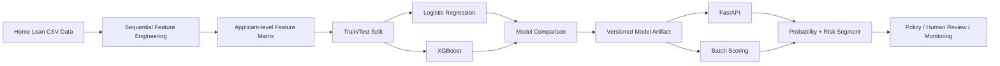

# Architecture

```mermaid
flowchart LR
    A[Home Loan CSV Data] --> B[Sequential Feature Engineering]
    B --> C[Applicant-level Feature Matrix]
    C --> D[Train/Test Split]
    D --> E[Logistic Regression]
    D --> F[XGBoost]
    E --> G[Model Comparison]
    F --> G
    G --> H[Versioned Model Artifact]
    H --> I[FastAPI]
    H --> J[Batch Scoring]
    I --> K[Probability + Risk Segment]
    J --> K
    K --> L[Policy / Human Review / Monitoring]
```
