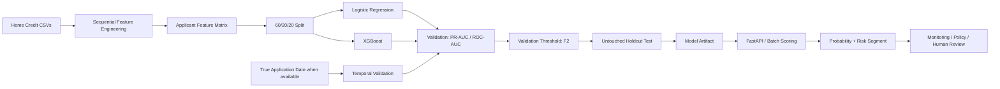

# Architecture

```mermaid
flowchart LR
 A[Home Credit CSVs] --> B[Sequential Feature Engineering]
 B --> C[Applicant Feature Matrix]
 C --> D[60/20/20 Split]
 D --> E[Logistic Regression]
 D --> F[XGBoost]
 E --> G[Validation: PR-AUC / ROC-AUC]
 F --> G
 G --> H[Validation Threshold: F2]
 H --> I[Untouched Holdout Test]
 I --> J[Model Artifact]
 J --> K[FastAPI / Batch Scoring]
 K --> L[Probability + Risk Segment]
 L --> M[Monitoring / Policy / Human Review]
 N[True Application Date when available] --> O[Temporal Validation]
 O --> G
```
