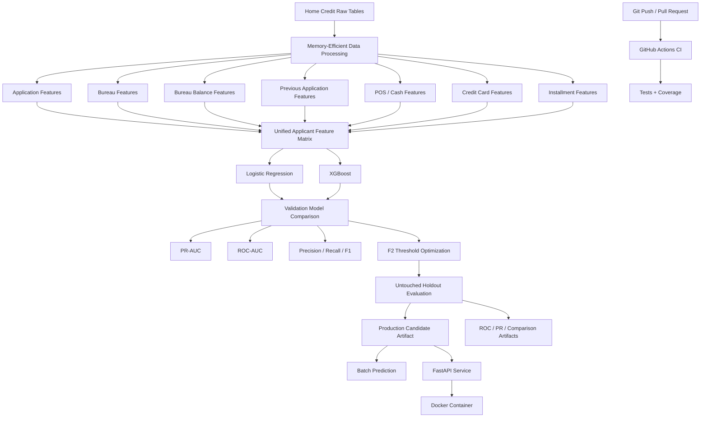

<div align="center">

# 🏠 Home Loan Default Risk
## Production-Oriented Credit Risk ML System

**End-to-End Machine Learning • Credit Risk • Memory-Efficient ML • FastAPI • Docker • CI**


</div>

---

## 🎯 Project Overview

**Home Loan Default Risk** is a production-oriented machine learning project for estimating the probability that a home-loan applicant will default.

Rather than stopping at notebook-based modelling, the repository demonstrates a broader ML engineering workflow built around the Home Credit data:

```text
Home Credit Raw Tables
        ↓
Memory-Efficient Data Processing
        ↓
Applicant-Level Feature Engineering
        ↓
Logistic Regression + XGBoost
        ↓
Imbalance-Aware Model Evaluation
        ↓
Validation-Based Model Selection
        ↓
F2 Threshold Optimization
        ↓
Untouched Holdout Evaluation
        ↓
Serialized Model Artifact
        ↓
FastAPI Inference
        ↓
Docker Container
        ↓
Automated Tests + GitHub Actions CI
```

The project is deliberately designed to remain practical on an **8 GB RAM machine** while demonstrating the modelling, serving, testing and governance patterns expected in a FinTech / ML Engineering portfolio.

> **Important:** This is a portfolio/research system and not an autonomous lending-decision engine. Real credit deployment requires approved data lineage, security/privacy controls, calibration, fairness assessment, out-of-time validation, monitoring, human oversight and formal model-risk governance.

---

## 🌿 Repository Branches

This repository intentionally contains **two branches representing two stages of the project**.

| Branch | Purpose |
|---|---|
| `main` | Original end-to-end deployment implementation based on the compact 8 GB XGBoost notebook |
| `production-hardening` | Extended ML-engineering version with stronger validation, class-imbalance handling, chunked `bureau_balance` processing, evaluation artifacts, tests/coverage, CI and temporal-validation framework |

### Branch Evolution

```text
main
 │
 │  Compact 8 GB modelling pipeline
 │  Logistic Regression + XGBoost
 │  FastAPI
 │  Batch scoring
 │  Docker
 │
 ▼
production-hardening
 │
 ├── Stronger train / validation / holdout design
 ├── PR-AUC-aware model selection
 ├── F2 threshold optimization
 ├── Explicit imbalance handling
 ├── Chunked bureau_balance integration
 ├── Evaluation artifact generation
 ├── Expanded automated tests
 ├── Coverage reporting
 ├── GitHub Actions CI
 └── Temporal-validation framework
```

The `production-hardening` branch is the stronger branch for ML Engineer / Data Scientist portfolio review.

---

## ⭐ Project Highlights

| Capability | Implementation |
|---|---|
| 🏦 Business Problem | Home-loan default-risk prediction |
| 🗃️ Data Architecture | Multi-table Home Credit data |
| 💾 Resource Strategy | Memory-conscious pipeline for an 8 GB RAM machine |
| ⚙️ Feature Engineering | Application + historical credit-behaviour aggregates |
| 📚 Bureau Balance | Chunked applicant-level delinquency aggregation on `production-hardening` |
| 🤖 Models | Logistic Regression + XGBoost |
| ⚖️ Class Imbalance | Balanced LR + XGBoost `scale_pos_weight` |
| 📊 Evaluation | ROC-AUC, PR-AUC, precision, recall, F1 |
| 🎯 Threshold Strategy | Validation-based F2 optimization |
| 🧪 Holdout Design | Untouched holdout evaluation on hardened branch |
| 🚀 Model Serving | FastAPI |
| 📦 Containerization | Docker |
| 🔮 Batch Prediction | Implemented |
| 🧪 Testing | Pytest |
| 📏 Test Coverage | `pytest-cov` |
| 🔄 Continuous Integration | GitHub Actions on hardened branch |
| 🕒 Temporal Validation | Framework implemented; real timestamp required |
| 🏛️ Governance | Production-readiness limitations documented |

---

# 🏗️ System Architecture



---

# 🏦 Business Problem

Credit-risk teams need to estimate which applicants have a higher probability of future default.

The modelling objective is:

```text
P(Home-loan applicant defaults)
```

The model output can support downstream processes such as:

- applicant risk ranking
- manual-review prioritization
- portfolio segmentation
- underwriting decision support
- credit-risk monitoring

The ML model should be treated as a **risk signal**, not as an uncontrolled replacement for lending policy or human underwriting.

---

# 🗃️ Data Architecture

The project uses multiple Home Credit tables rather than a single pre-engineered modelling file.

```text
application_train.csv
        +
bureau.csv
        +
bureau_balance.csv
        +
previous_application.csv
        +
POS_CASH_balance.csv
        +
credit_card_balance.csv
        +
installments_payments.csv
        ↓
Applicant-Level Feature Engineering
```

The historical tables are aggregated to `SK_ID_CURR` so that the final modelling dataset contains one feature vector per applicant.

### Branch Difference

The `main` branch deliberately does **not** expand `bureau_balance.csv` in order to preserve the original compact 8 GB design.

The `production-hardening` branch improves this by processing `bureau_balance.csv` in chunks and retaining compact delinquency features.

---

# 💾 Memory-Efficient Data Engineering

The Home Credit historical tables are substantially larger than the application table.

The project therefore uses a resource-aware design:

- load only required columns
- process historical tables sequentially
- aggregate before joining
- avoid retaining large intermediate tables
- delete intermediate DataFrames
- call garbage collection
- use compact numeric feature matrices
- cast model matrices to `float32`
- use CPU XGBoost with `tree_method="hist"`
- constrain tree depth and parallelism

On the hardened branch, `bureau_balance.csv` is processed in chunks rather than loaded and expanded as a large intermediate matrix.

---

# ⚙️ Feature Engineering

The feature pipeline combines applicant information with historical credit behaviour.

Major feature groups include:

### Application / Affordability Features

- income
- credit amount
- annuity
- goods price
- family size
- children
- employment history
- regional risk indicators

### External Risk Scores

- `EXT_SOURCE_1`
- `EXT_SOURCE_2`
- `EXT_SOURCE_3`

### Bureau Features

- bureau credit count
- average bureau credit amount
- debt exposure
- overdue exposure

### Bureau Balance Features — Hardened Branch

- bureau-balance record count
- delinquency rate
- maximum delinquency indicator

### Previous Application Features

- previous application count
- average previous credit
- average requested amount

### POS / Cash Features

- DPD behaviour
- DPD-def behaviour
- record count

### Credit Card Features

- average balance
- credit limit
- DPD behaviour

### Installment Features

- payment delay
- payment shortfall
- installment record count

---

# 🤖 Model Development

Two candidate models are used.

## Logistic Regression

Logistic Regression provides an interpretable linear baseline.

On the hardened branch it uses:

```python
class_weight="balanced"
```

This makes the baseline explicitly aware of the class imbalance.

## XGBoost

XGBoost is the nonlinear boosted-tree candidate.

The resource-conscious configuration uses design choices including:

```text
tree_method = hist
max_depth = 3
n_estimators = 120
max_bin = 64
subsample = 0.80
colsample_bytree = 0.70
n_jobs = 2
```

On the hardened branch, class imbalance is handled using:

```text
scale_pos_weight = negatives / positives
```

---

# ⚖️ Class-Imbalance Strategy

Home-loan default is an imbalanced classification problem.

A high overall accuracy can therefore be misleading if the model performs poorly on default cases.

The hardened pipeline evaluates:

```text
ROC-AUC
PR-AUC
Accuracy
Precision
Recall
F1
```

Model selection gives particular attention to **PR-AUC** because it is informative when the positive/default class is relatively rare.

---

# 🧪 Train / Validation / Holdout Strategy

The hardened pipeline separates model development from final evaluation.

Conceptually:

```text
Full Labelled Dataset
        ↓
Development Data + Untouched Holdout
        ↓
Training + Validation inside Development Data
        ↓
Candidate Model Training
        ↓
Validation Model Selection
        ↓
Validation Threshold Optimization
        ↓
Freeze Model + Threshold
        ↓
Untouched Holdout Evaluation
```

The current implementation performs an outer 20% holdout split and then takes 20% of the remaining development sample as validation. This corresponds to approximately:

```text
64% Training
16% Validation
20% Untouched Holdout
```

This distinction is important because the holdout set is not used for candidate-model or threshold selection.

---

# 🎯 Decision Threshold Optimization

A fixed classification threshold of `0.50` is not assumed to be optimal.

The hardened pipeline searches thresholds on validation data and selects the threshold using the **F2 score**.

```text
Validation Probabilities
        ↓
Candidate Thresholds
        ↓
Precision / Recall Trade-off
        ↓
F2 Optimization
        ↓
Selected Threshold
        ↓
Frozen Before Holdout Evaluation
```

F2 gives greater weight to recall than standard F1.

In a real lending environment, the final operating threshold should be based on business costs, underwriting capacity, expected losses, risk appetite and governance requirements rather than F2 alone.

---

# 📊 Model Performance

The repository contains the code required to calculate and persist model-performance results.

The original local notebook work produced an XGBoost ROC-AUC of approximately:

## **ROC-AUC ≈ 0.75**

This value should be treated as a **development-run result**, not as a committed reproducible holdout result.

The hardened training pipeline is designed to generate exact validation and holdout results in:

```text
models/validation_metrics.csv
models/holdout_test_metrics.csv
```

At the time this README was prepared, those generated metrics files were **not committed to the GitHub branch**, so exact holdout PR-AUC, precision, recall and F1 values are intentionally not invented here.

### Evaluation Strategy

| Metric | Why It Matters |
|---|---|
| ROC-AUC | Measures ranking/discrimination across thresholds |
| PR-AUC | More informative for the minority/default class |
| Precision | Measures reliability of positive/default predictions |
| Recall | Measures how many actual defaults are identified |
| F1 | Balances precision and recall |
| F2 | Used for validation threshold selection with more recall emphasis |

---

# 📈 ROC Curve

The hardened training pipeline generates:

```text
artifacts/roc_curves.png
```

When the generated artifact is committed, it can be displayed directly in this README:

```markdown

```

The current GitHub branch contains the artifact-generation pipeline but does not yet contain the generated ROC PNG. Therefore this README does not display a broken or fabricated plot.

---

# 📉 Precision-Recall Evaluation

The hardened pipeline also generates:

```text
artifacts/precision_recall_curves.png
```

PR analysis is especially important in this project because the default class is imbalanced.

A model may achieve an apparently strong accuracy while still having weak default-class detection. Precision-recall analysis exposes this trade-off more clearly.

---

# 📊 Model Comparison Artifact

Candidate-model performance can be visualized using:

```text
artifacts/model_comparison.png
```

The artifact compares the evaluation results produced by Logistic Regression and XGBoost.

As with the ROC and PR plots, the pipeline exists but the generated PNG is not currently committed to the hardened branch.

---

# 🚀 Production Prediction Pipeline

After model training, the selected model is serialized for reusable inference.

```text
Applicant Features
       ↓
Trained Pipeline
       ↓
Default Probability
       ↓
Risk-Segment Assignment
       ↓
Prediction Output
```

The same model artifact can support:

- FastAPI inference
- batch scoring
- containerized deployment

---

# 🌐 FastAPI Model Serving

The repository exposes model inference through FastAPI.

```text
Client
   ↓
FastAPI
   ↓
Input Validation
   ↓
Serialized ML Pipeline
   ↓
Default Probability
   ↓
Risk Segment
   ↓
JSON Response
```

Run locally:

```bash
uvicorn api.main:app --reload
```

Interactive documentation:

```text
http://127.0.0.1:8000/docs
```

Endpoints include:

```text
GET  /health
GET  /metadata
POST /predict
```

Example response structure:

```json
{
  "SK_ID_CURR": 100001,
  "default_probability": 0.123456,
  "risk_segment": "Eligible / Lower Risk"
}
```

The probability above is illustrative and is not presented as a real applicant prediction.

---

# 🔮 Batch Prediction

Batch scoring is available through:

```bash
python scripts/predict_batch.py \
  --data-dir data \
  --model-path models/home_loan_default_model.joblib \
  --output artifacts/predictions.csv
```

The output contains applicant identifiers, predicted default probabilities and risk segments.

---

# 📦 Docker Containerization

The inference service is containerized using:

```text
Dockerfile
docker-compose.yml
.dockerignore
```

Build:

```bash
docker build -t home-loan-risk-api .
```

Run:

```bash
docker run --rm -p 8000:8000 home-loan-risk-api
```

or:

```bash
docker compose up --build
```

Containerization provides a reproducible serving environment and separates the inference application from the host machine.

---

# 🧪 Automated Testing

The `production-hardening` branch expands automated testing beyond the original API test.

```text
tests/
├── test_api.py
├── test_features.py
└── test_metrics.py
```

Testing covers core areas such as:

- API behaviour
- feature-processing behaviour
- evaluation metric logic
- threshold-selection logic

Run:

```bash
pytest -q
```

With coverage:

```bash
pytest --cov=src --cov=api --cov-report=term-missing
```

<<<<<<< HEAD

=======
No test-count or coverage percentage is claimed here until a successful CI run provides the actual evidence.
>>>>>>> 82e9fb3 (Rewrite README with production ML architecture and results)

---

# 🔄 Continuous Integration

The hardened branch contains a GitHub Actions workflow:

<<<<<<< HEAD
=======
```text
.github/workflows/ci.yml
```

The intended CI flow is:

```text
Git Push / Pull Request
        ↓
GitHub Actions
        ↓
Python Environment
        ↓
Install Dependencies
        ↓
pytest + Coverage
        ↓
Coverage Artifact
```

This moves verification away from a manual-only workflow.

---

# 🕒 Temporal Validation Framework

True out-of-time credit-risk validation requires a genuine application or decision timestamp.

The public Home Credit application table used by this project does not provide a direct calendar application timestamp suitable for this purpose.

The hardened branch therefore **does not manufacture temporal validation** using fields such as:

```text
SK_ID_CURR
DAYS_BIRTH
DAYS_EMPLOYED
```

Instead, it provides:

```text
src/validation.py
scripts/temporal_validation.py
```

When an approved application date is available:

```bash
python scripts/temporal_validation.py --date-column APPLICATION_DATE
```

This is a deliberate governance decision: the repository implements the temporal-validation capability without claiming an unsupported out-of-time result.

---

# 📡 Monitoring & Model Governance

Unlike the Bank GoodCredit project, this repository does **not currently contain an implemented PSI monitoring system with committed monitoring results**.

For a future production deployment, important monitoring areas include:

```text
Feature Drift
Prediction Distribution Drift
Missing-Feature Rate
Calibration Drift
Realized Default Rate
ROC-AUC / PR-AUC Over Time
API Latency and Error Rate
Model / Feature Version Lineage
```

These are production-roadmap items rather than completed capabilities in the current repository.

---

# ☁️ Cloud Deployment Status

The current Home Loan repository demonstrates:

```text
Local ML Pipeline
      ↓
FastAPI
      ↓
Docker
```

It does **not currently contain verified AWS SageMaker/ECS/EKS production deployment evidence** comparable to the Bank GoodCredit project.

Cloud deployment should therefore be treated as a future extension rather than claimed as completed.

A suitable future architecture would be:

```text
GitHub
   ↓
CI
   ↓
Docker Image
   ↓
Amazon ECR
   ↓
Managed AWS Inference
   ↓
Cloud Prediction
   ↓
Cloud Monitoring
```

---

# 📁 Evaluation Artifacts

The hardened training pipeline is designed to generate:

```text
models/
├── home_loan_default_model.joblib
├── metadata.json
├── model_metrics.csv
├── validation_metrics.csv
└── holdout_test_metrics.csv

artifacts/
├── class_distribution.json
├── roc_curves.png
├── precision_recall_curves.png
└── model_comparison.png
```

The repository currently contains the code and artifact locations, but the generated model metrics and plots are not yet committed.

This distinction is intentional so that README evidence reflects actual reproducible outputs rather than fabricated results.

---

# 🧠 Engineering Decisions

### 1. Resource-Conscious ML

The system was designed around an 8 GB machine rather than assuming unlimited compute.

### 2. Sequential Historical Aggregation

Large historical tables are processed individually and reduced to applicant-level aggregates before merging.

### 3. Chunked Bureau-Balance Processing

The hardened branch restores `bureau_balance.csv` information without loading the complete expanded history into memory.

### 4. Baseline + Nonlinear Challenger

Logistic Regression provides an interpretable baseline while XGBoost captures nonlinear relationships.

### 5. Imbalance-Aware Evaluation

PR-AUC, precision and recall complement ROC-AUC and accuracy.

### 6. Validation-Based Threshold Selection

Threshold selection is separated from final holdout evaluation.

### 7. Honest Temporal-Validation Limitation

The project does not substitute an identifier or relative-age feature for a genuine application timestamp.

### 8. Reusable Inference

Training logic is separated from FastAPI and batch-scoring workflows.

### 9. Testable Deployment Structure

Automated tests and CI are part of the hardened repository rather than relying only on notebook execution.

---

# 📂 Repository Structure

The `production-hardening` branch follows this structure:

```text
Home_Loan_Default_ML/
│
├── api/
│   └── main.py
│
├── src/
│   ├── features.py
│   ├── metrics.py
│   └── validation.py
│
├── scripts/
│   ├── train.py
│   ├── evaluate.py
│   ├── predict_batch.py
│   └── temporal_validation.py
│
├── notebooks/
│   └── Home_Loan_Default_8GB_XGBoost.ipynb
│
├── tests/
│   ├── test_api.py
│   ├── test_features.py
│   └── test_metrics.py
│
├── artifacts/
├── models/
├── data/
│
├── .github/
│   └── workflows/
│       └── ci.yml
│
├── ARCHITECTURE.md
├── Dockerfile
├── docker-compose.yml
├── requirements.txt
└── README.md
```

---

# ▶️ Running the Project

## Clone

```bash
git clone https://github.com/rc-mathew/Home_Loan_Default_ML.git
cd Home_Loan_Default_ML
```

## Use the Hardened Branch

```bash
git checkout production-hardening
```

## Create Environment

Windows:

```bash
python -m venv .venv
.venv\Scripts\activate
pip install -r requirements.txt
```

Linux / macOS:

```bash
python -m venv .venv
source .venv/bin/activate
pip install -r requirements.txt
```

## Train

```bash
python scripts/train.py --data-dir data --model-dir models
```

## Run Tests

```bash
pytest -q
```

## Run API

```bash
uvicorn api.main:app --reload
```

## Run with Docker

```bash
docker compose up --build
```

---

# 🛣️ Production Roadmap

The highest-value remaining extensions are:

- [ ] Commit reproducible holdout metrics
- [ ] Commit ROC / PR / model-comparison plots
- [ ] Add probability calibration and Brier score
- [ ] Add SHAP explainability
- [ ] Add subgroup / fairness auditing
- [ ] Implement PSI or equivalent feature-drift monitoring
- [ ] Add prediction-drift monitoring
- [ ] Add MLflow experiment tracking / model registry
- [ ] Deploy and verify a real cloud inference endpoint
- [ ] Add cloud prediction evidence
- [ ] Add operational monitoring evidence
- [ ] Perform true out-of-time validation when a valid timestamp is available

---

# 🏛️ Production Readiness

This repository demonstrates a **production-oriented ML engineering workflow**, but it should not be described as a live banking production system.

A real lending deployment would additionally require:

- approved production data pipelines
- authentication and authorization
- encryption and secrets management
- feature/data/model lineage
- model registry and controlled promotion
- probability calibration
- fairness and legal review
- live drift monitoring
- performance monitoring after labels mature
- audit logging
- rollback strategy
- underwriting-policy integration
- human-review workflows
- formal model-risk approval

---

# 🎓 Portfolio Value

The project demonstrates practical discussion points for ML Engineer and Data Scientist interviews:

```text
Credit-Risk Modelling
Class Imbalance
ROC-AUC vs PR-AUC
Threshold Optimization
Memory-Efficient Feature Engineering
Large Historical Tables
XGBoost
FastAPI
Docker
Automated Testing
GitHub Actions CI
Holdout Discipline
Temporal Validation
Model Governance
Production ML Architecture
```

The two-branch structure also shows the evolution from an initial deployable ML implementation to a more rigorous production-hardening stage.

---

# ⚠️ Disclaimer

This repository is intended for **machine-learning engineering, portfolio and educational use**.

The model must not be used as an autonomous real-world lending decision system without appropriate data validation, security controls, probability calibration, fairness assessment, explainability, out-of-time validation, monitoring, regulatory review, policy controls and human oversight.
>>>>>>> 82e9fb3 (Rewrite README with production ML architecture and results)
