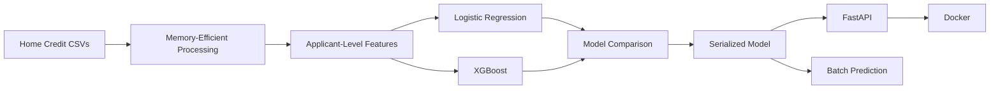

<div align="center">

# 🏠 Home Loan Default Risk
## End-to-End Credit Risk ML System

**Machine Learning • Credit Risk • XGBoost • FastAPI • Docker**


</div>

> [!IMPORTANT]
> ### 🌿 This is the `main` branch
> This branch preserves the **original end-to-end deployment implementation**.
>
> For the strongest ML Engineering version of this project, review the
> **[`production-hardening` branch](../../tree/production-hardening)**.
>
> That branch adds stronger validation, explicit class-imbalance handling, chunked `bureau_balance` integration, PR-AUC-aware evaluation, F2 threshold optimization, expanded tests/coverage, GitHub Actions CI, and a temporal-validation framework.

---

# 🎯 Project Overview

This project predicts **home-loan default risk** using Home Credit application and historical credit data.

The goal was not only to train a classifier, but to convert the modelling workflow into a reusable deployment project that can run on a resource-constrained machine.

```text
Home Credit Data
       ↓
Memory-Efficient Feature Engineering
       ↓
Applicant-Level Feature Matrix
       ↓
Logistic Regression + XGBoost
       ↓
Model Evaluation
       ↓
Serialized ML Pipeline
       ↓
FastAPI + Batch Prediction
       ↓
Docker
```

> This is a portfolio/research system, not an autonomous real-world lending decision engine.

---

# ⭐ Main Branch Highlights

| Capability | Implementation |
|---|---|
| 🏦 Use Case | Home-loan default-risk prediction |
| 🗃️ Data | Multi-table Home Credit dataset |
| 💾 Resource Design | Optimized for an 8 GB RAM machine |
| ⚙️ Feature Engineering | Applicant + historical credit aggregates |
| 🤖 Models | Logistic Regression + XGBoost |
| 📊 Evaluation | Classification metrics and model comparison |
| 🚀 Serving | FastAPI |
| 🔮 Batch Scoring | Implemented |
| 📦 Containerization | Docker |
| 🧪 API Testing | Pytest |
| 🌿 Advanced Version | `production-hardening` branch |

---

# 🏗️ Architecture



---

# 🗃️ Data

The project uses Home Credit tables including:

```text
application_train.csv
bureau.csv
previous_application.csv
POS_CASH_balance.csv
credit_card_balance.csv
installments_payments.csv
```

The original `main` implementation deliberately avoids directly expanding the very large `bureau_balance.csv` table to keep the workflow practical on an 8 GB machine.

The **`production-hardening` branch** improves this by processing `bureau_balance.csv` in chunks and retaining compact applicant-level delinquency features.

---

# 💾 Memory-Efficient Feature Engineering

The pipeline is designed around limited local memory.

Key decisions include:

- reading only required columns
- processing historical tables sequentially
- aggregating before joining
- deleting large intermediate DataFrames
- garbage collection between stages
- compact numeric feature matrices
- `float32` model inputs
- constrained CPU XGBoost
- histogram-based tree training

These choices allow the project to demonstrate multi-table credit-risk modelling without requiring a high-memory workstation.

---

# 🤖 Models

## Logistic Regression

Used as a simple, interpretable baseline.

## XGBoost

Used as the nonlinear boosted-tree candidate.

The local development work produced an XGBoost ROC-AUC of approximately:

## **ROC-AUC ≈ 0.75**

This is a **development-run result**, not a claimed production or independently verified banking benchmark.

---

# 🚀 FastAPI Serving

The trained model can be exposed through FastAPI.

Run locally:

```bash
uvicorn api.main:app --reload
```

Interactive API documentation:

```text
http://127.0.0.1:8000/docs
```

Available endpoints include:

```text
GET  /health
GET  /metadata
POST /predict
```

The API returns a default probability together with a risk-segment output.

---

# 🔮 Batch Prediction

The repository also supports offline batch scoring:

```bash
python scripts/predict_batch.py \
  --data-dir data \
  --model-path models/home_loan_default_model.joblib \
  --output artifacts/predictions.csv
```

This separates model training from reusable inference.

---

# 📦 Docker

Build the inference container:

```bash
docker build -t home-loan-risk-api .
```

Run:

```bash
docker run --rm -p 8000:8000 home-loan-risk-api
```

or:

```bash
docker compose up --build
```

---

# 🌿 Project Evolution

The repository uses two branches to show the progression from a deployable baseline to a more rigorous ML-engineering implementation.

```text
main
 │
 ├── Memory-efficient ML pipeline
 ├── Logistic Regression + XGBoost
 ├── FastAPI
 ├── Batch inference
 └── Docker
 │
 ▼
production-hardening
 │
 ├── Stronger train / validation / holdout discipline
 ├── Explicit class-imbalance handling
 ├── Chunked bureau_balance integration
 ├── PR-AUC-aware model evaluation
 ├── F2 threshold optimization
 ├── Evaluation artifact generation
 ├── Expanded tests + coverage
 ├── GitHub Actions CI
 └── Temporal-validation framework
```

### 👉 Recommended technical branch

For ML Engineer / Data Scientist portfolio review, continue to:

**[`production-hardening`](../../tree/production-hardening)**

The hardened README contains the full architecture, validation methodology, evaluation design, governance limitations, testing/CI details and production roadmap.

---

# 📂 Main Branch Structure

```text
Home_Loan_Default_ML/
│
├── api/
│   └── main.py
│
├── src/
│   └── features.py
│
├── scripts/
│   ├── train.py
│   └── predict_batch.py
│
├── tests/
│   └── test_api.py
│
├── data/
├── models/
│
├── Dockerfile
├── docker-compose.yml
├── requirements.txt
├── ARCHITECTURE.md
└── README.md
```

---

# ▶️ Run Locally

Clone the repository:

```bash
git clone https://github.com/rc-mathew/Home_Loan_Default_ML.git
cd Home_Loan_Default_ML
```

Create an environment:

```bash
python -m venv .venv
```

Windows:

```bash
.venv\Scripts\activate
```

Install dependencies:

```bash
pip install -r requirements.txt
```

Train:

```bash
python scripts/train.py --data-dir data --model-dir models
```

Start the API:

```bash
uvicorn api.main:app --reload
```

---

# 🧠 What This Branch Demonstrates

The `main` branch demonstrates the transition from notebook experimentation to a reusable ML application:

```text
Multi-Table Feature Engineering
        +
Credit-Risk Classification
        +
Resource-Constrained ML
        +
Reusable Training
        +
API Inference
        +
Batch Prediction
        +
Docker
```

For the advanced validation, testing, CI and governance work, use `production-hardening`.

---

# ⚠️ Disclaimer

This repository is intended for **machine-learning engineering, portfolio and educational use**.

A real lending deployment would additionally require approved production data pipelines, security controls, calibration, fairness assessment, explainability, out-of-time validation, live monitoring, auditability, policy integration, formal model-risk approval and human oversight.
